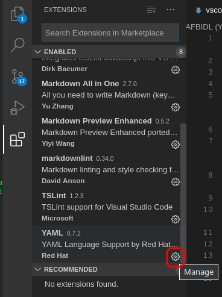
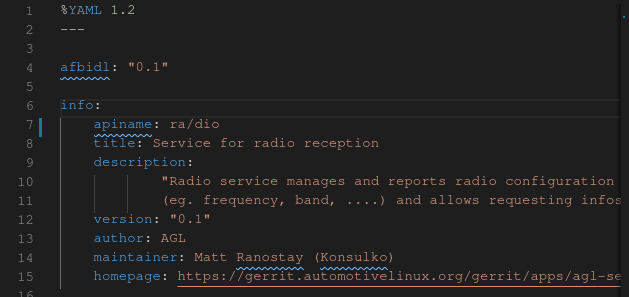
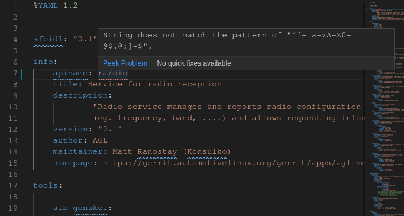

# HOWTO setup AFBIDL (YaML) validation in vscod{e,ium}

## install YAML extension

This extension provided by redhat. The description of the extension should state:

> Provides comprehensive YAML Language support to Visual Studio Code, via
> the yaml-language-server [...]

**NOTE** : PLEASE ACTIVATE THE EXTENSION IF NEEDED


## Configuring the extension

1. In the extension panel, click on the gear:



and select "extension settings"

2. In the configuration panel, ensure that the following options are enabled
    * Yaml: Completion
    * Yaml › Format: Enable
    * Yaml: Hover
    * Yaml: Validate

3. in `Yaml: Schemas`, click on `edit in settings.json`

4. It should open a file containing only an empty object `{ }`. Don't bother if it is not, though...

5. Finally, add the following property to this object:

```json
    "yaml.schemas": {
        "https://raw.githubusercontent.com/iotbzh/afbidl/master/afbidl-schema.json" : ["**/*.yml"]
    },
```

You obviously may tweak the glob pattern if needed !

## Results

Before installing and configuring the extension:



Note that even if `apiname` is not a valid API name in the sense of AFB, it is still valid raw YaML and no error is reported.

With the extension, activated and configured, an error is reported:



## Troubleshooting

If VSCode still cowardly refuses to validate the AFBIDL / YaML file, you may try :

* Closing and reopening the YaML file
* Closing and relaunching VSCod{e,ium}
* WHEN IN DOUBT... REBOOT.
